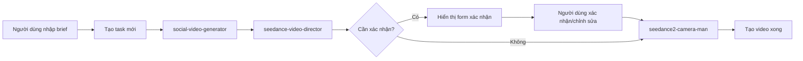

## 1. Tổng quan sản phẩm
Giao diện web cho Agent Orchestrator Seedance 2.0, cho phép người dùng nhập brief sản phẩm, theo dõi quá trình tạo video và xác nhận thông tin (human-in-the-loop) trước khi seedance2-camera-man gọi API tạo video cuối cùng.

- Giải quyết vấn đề: Người dùng không cần gọi API thủ công, có thể tương tác trực quan qua giao diện web để quản lý toàn bộ quy trình tạo video
- Đối tượng người dùng: Nhà sáng tạo nội dung, marketer, chủ doanh nghiệp cần tạo video marketing trên social media

## 2. Tính năng chính

### 2.1 Vai trò người dùng
| Vai trò | Phương thức đăng nhập | Quyền hạn chính |
|---------|------------------------|-----------------|
| Người dùng cuối | Không yêu cầu đăng nhập | Nhập brief, theo dõi trạng thái, xác nhận thông tin |

### 2.2 Các module chính
1. **Trang chủ**: Form nhập brief, xem danh sách task, trạng thái tổng quan
2. **Trang chi tiết task**: Theo dõi từng bước xử lý, form xác nhận thông tin khi cần human-in-the-loop, xem video hoàn thành
3. **Trang xác nhận**: Hiển thị các thông tin cần người dùng xác nhận trước khi tiếp tục quy trình

### 2.3 Chi tiết trang
| Tên trang | Tên module | Mô tả tính năng |
|-----------|------------|-----------------|
| Trang chủ | Form nhập brief | Input cho brief sản phẩm, upload/dán link ảnh sản phẩm, chọn tỷ lệ video, thời lượng |
| Trang chủ | Danh sách task | Hiển thị tất cả các task đã tạo, trạng thái từng task |
| Trang chi tiết | Quy trình xử lý | Timeline hiển thị từng bước: social-video-generator → seedance-video-director → seedance2-camera-man |
| Trang chi tiết | Form xác nhận | Hiển thị các thông tin còn thiếu/cần xác nhận, cho phép người dùng chỉnh sửa và tiếp tục |

## 3. Luồng xử lý chính
Người dùng nhập brief → Tạo task mới → Hệ thống chạy social-video-generator → seedance-video-director → Nếu có thông tin không rõ: hiển thị form xác nhận → Người dùng xác nhận → seedance2-camera-man gọi API tạo video → Hoàn thành, hiển thị link video.

## 4. Thiết kế giao diện người dùng
### 4.1 Phong cách thiết kế
- Màu chủ đạo: Xanh dương đậm (#0f172a) làm nền, cam (#f97316) làm màu accent cho các nút hành động, trắng/xám nhạt cho text
- Nút bấm: Bo tròn nhẹ, hiệu ứng hover, shadow đổ mềm
- Font: Inter cho nội dung, Playfair Display cho tiêu đề chính
- Bố cục: Card-based, thanh điều hướng top, khoảng trắng hợp lý, dễ đọc
- Icon: Sử dụng Lucide icons đơn giản, nhất quán

### 4.2 Tổng quan thiết kế trang
| Tên trang | Tên module | Các yếu tố UI |
|-----------|------------|---------------|
| Trang chủ | Hero section | Nền gradient tối, tiêu đề lớn, form nhập brief nổi bật |
| Trang chi tiết | Timeline | Vertical timeline hiển thị trạng thái từng bước, màu xanh cho hoàn thành, vàng cho đang xử lý |
| Tất cả các trang | Xác nhận | Modal overlay hiển thị form xác nhận, nút "Xác nhận" và "Từ chối" rõ ràng |

### 4.3 Responsiveness
Desktop-first, hỗ trợ mobile với layout stacking, font-size điều chỉnh tự động, touch-friendly các nút bấm.
