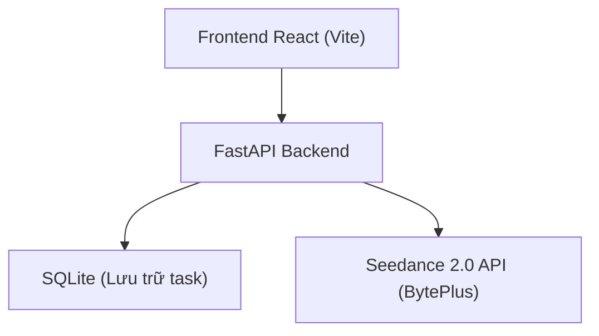

## 1. Thiết kế kiến trúc



## 2. Mô tả công nghệ

* Frontend: React 18 + TypeScript + TailwindCSS 3 + Vite 5

* Backend: FastAPI (Python) - đã có sẵn main.py

* Database: SQLite để lưu trữ thông tin task (thay thế cho in-memory current)

* External Services: Seedance 2.0 API (BytePlus) để tạo video

## 3. Định nghĩa route

| Route     | Mục đích                                                     |
| --------- | ------------------------------------------------------------ |
| /         | Trang chủ, form nhập brief, danh sách task                   |
| /task/:id | Trang chi tiết task, theo dõi trạng thái, xác nhận thông tin |

## 4. Định nghĩa API (tích hợp với backend hiện có)

```typescript
interface VideoBrief {
  brief: string;
  product_images?: string[];
  ratio: string;
  duration: number;
  generate_audio: boolean;
}

interface TaskStatus {
  task_id: string;
  status: 'queued' | 'processing' | 'completed' | 'failed' | 'waiting_confirmation';
  current_step: string;
  video_url?: string;
  error?: string;
  confirmation_required?: {
    field: string;
    message: string;
    current_value?: any;
  }[];
}

// API Endpoints
POST /api/create-video - Tạo task mới
GET /api/task/{task_id} - Lấy trạng thái task
POST /api/task/{task_id}/confirm - Xác nhận thông tin, tiếp tục xử lý
GET /api/tasks - Lấy danh sách task
```

## 5. Cập nhật backend để hỗ trợ human-in-the-loop

Thêm endpoint `/api/task/{task_id}/confirm` để người dùng gửi thông tin xác nhận, backend cập nhật và tiếp tục quy trình. Lưu trạng thái `waiting_confirmation` khi cần hỏi người dùng.
